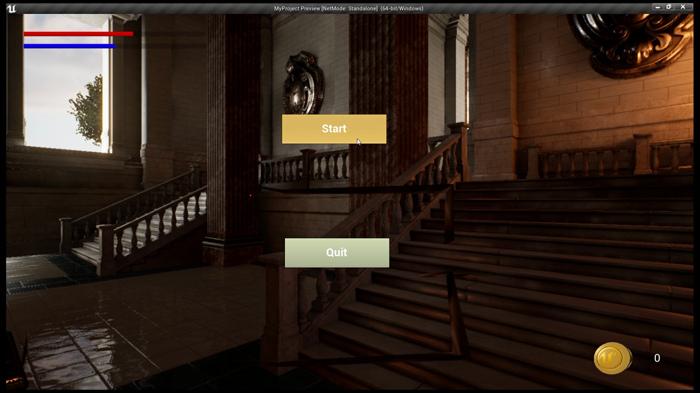
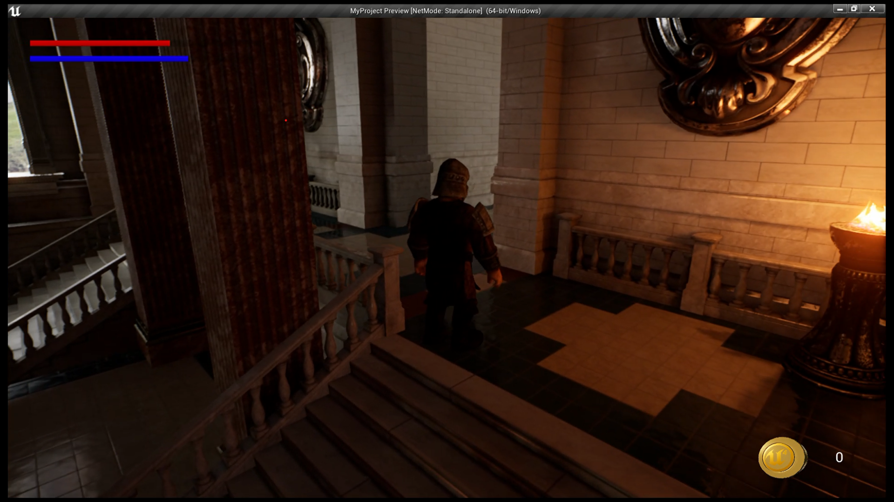
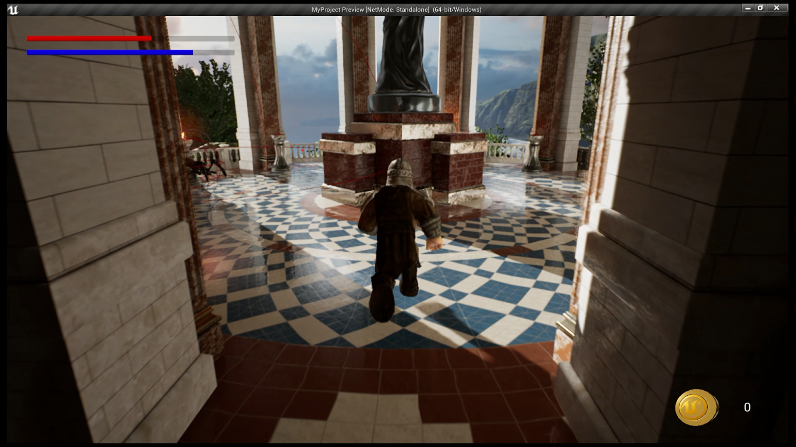
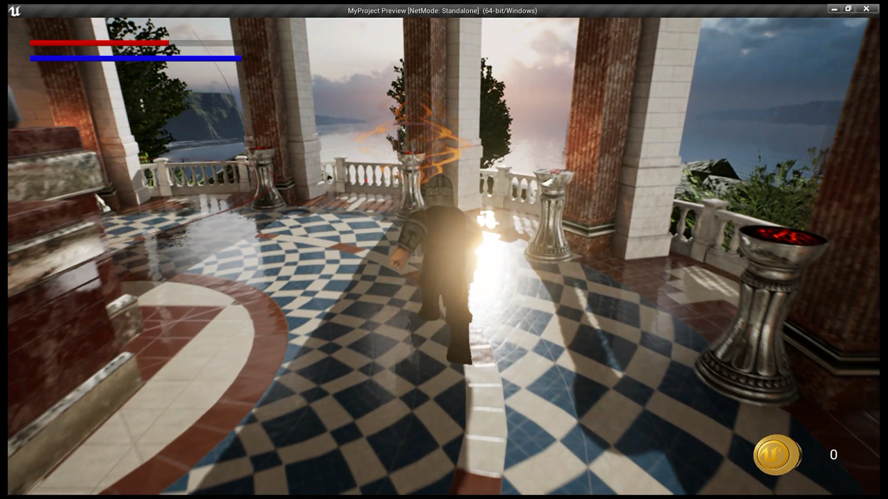
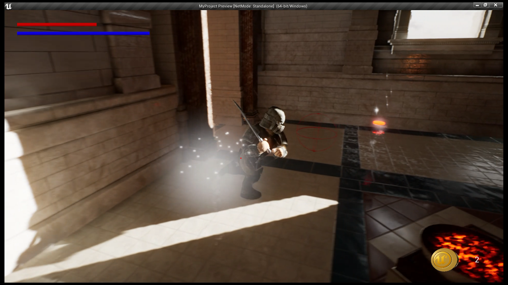
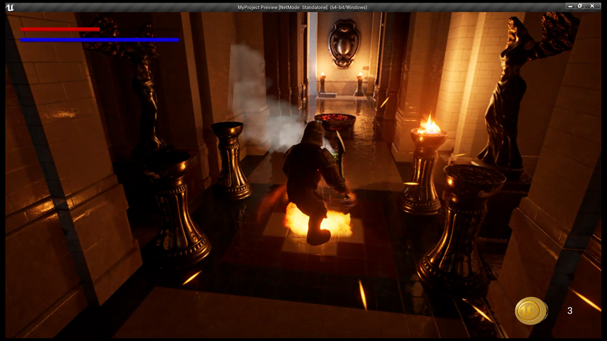
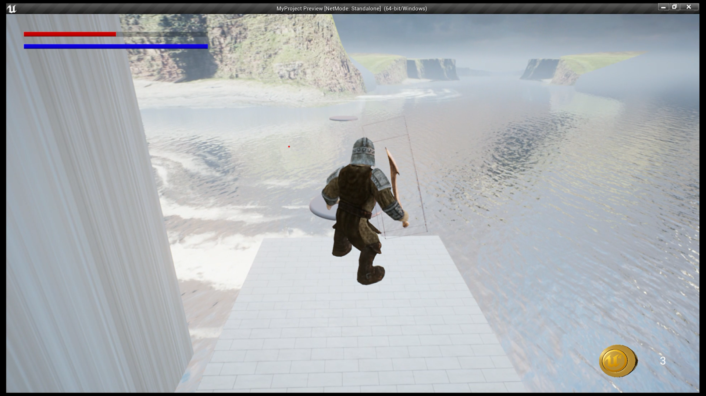
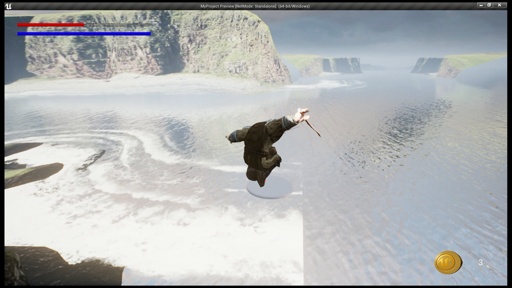

# Hidden-Temple-Explorer-Unreal-Engine

### Overview
    A third-person role-playing game where the player controls a character on a quest to explore a hidden temple
    and uncover its secrets. The game includes various ancient creatures that the player must face to progress 
    through the temple.
    
### Features
    Immersive Exploration: 
    - Navigate through a captivating environment filled with ancient wonders and hidden dangers.

    Dynamic Animations: 
    - Smooth animations for various in-game actions, including idle stances, running, jumping, and equipping weapons.

    AI Enemies: 
    - Intelligent AI enemies with patrolling behaviors. Stay alert as they can chase you down and launch attacks.

    Gameplay Mechanics: 
    - Player stats such as health and stamina, collectibles, and various pickups.

 ### Screenshots
   
   
   
   
   
   
   
   
   
### Implementation

    Player Animations:
     - Implemented third-person animations for idle, run, jump, and weapon equipping.
     - Added detailed sword pickup and attack animations for a realistic feel.

    Enemy AI:
    - Developed AI enemies with patrolling behaviors.
    - Implemented pursuit and attack mechanisms.

    HUD and Sounds
    - Designed a comprehensive Heads-Up Display (HUD) to display player stats and essential information.
    - Integrated sound effects to enhance the immersive atmosphere.

    Gameplay Mechanics:
    - Implemented player stats such as health and stamina.
    - Introduced collectibles and pickups to reward players.
    

### Gameplay Demonstration
    - For a visual demonstration of the gameplay, watch video on YouTube:
  [Youtube video link](https://youtu.be/PqFRkxlfCQc)
